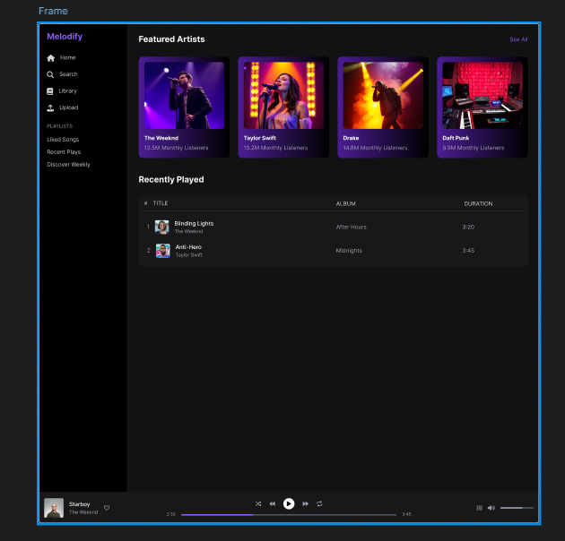
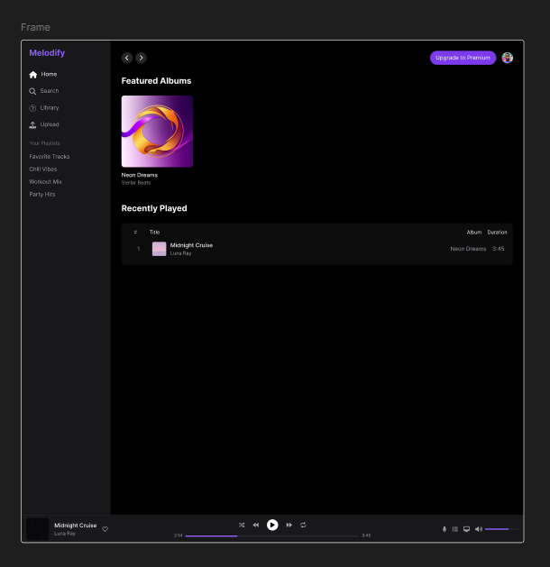

🎵 Project Media Player
A sleek, full-featured, dark-themed music streaming platform built using the MERN stack and deployed via Kubernetes on AWS EC2. Inspired by Spotify and YouTube Music.

                  

🚀 Tech Stack
Layer	Tech Used
Frontend	React.js + Tailwind CSS
Backend	Node.js (Express)
Database	PostgreSQL + Redis
Auth	JWT, Google OAuth
Containerization	Docker
Hosting	Caddy Server
Orchestration	Kubernetes (k8s) on AWS EC2
CI/CD	GitHub Actions (Planned)
🖼 UI Sneak Peek
🎧 Home & Player View	📂 Album & Library View
Designed with a dark premium theme using elegant purple & gold accents.

⚙️ Features
🎨 Elegant dark UI with luxury palette

🔐 User authentication (email + Google login)

📂 Personal library with playlists & albums

🔄 Real-time music queue & progress bar

⏯️ Fully-featured player (seek, pause, skip, volume)

📦 Microservice-ready architecture

🚀 Deployable via Docker + Kubernetes

☁️ Hosted on AWS EC2 instance with Caddy

📦 Microservices Architecture Diagram (Concept)
mermaid
Copy
Edit
graph TD
  A[Frontend (React)] -->|REST API| B[Auth Service]
  A --> C[Music Service]
  A --> D[User Library Service]
  B --> E[(PostgreSQL)]
  C --> E
  D --> F[(Redis)]
  G[NGINX/Caddy] --> A
  A --> G
🧪 Inspired by Kubernetes Voting App
This architecture was inspired by the legendary Kubernetes Voting App

📁 Project Structure (Planned)
bash
Copy
Edit
project-media-player/
│
├── client/               # React frontend
├── server/
│   ├── auth-service/     # Auth microservice
│   ├── music-service/    # Music upload/stream
│   ├── user-service/     # Library, playlists
│
├── infra/
│   ├── k8s/              # Kubernetes manifests
│   ├── docker/           # Dockerfiles & Compose
│
├── .env.example
├── README.md
└── LICENSE
🛠 Setup (Coming Soon)
bash
Copy
Edit
git clone https://github.com/yourusername/project-media-player
cd project-media-player
docker-compose up --build
📃 License
This project is licensed under the MIT License.